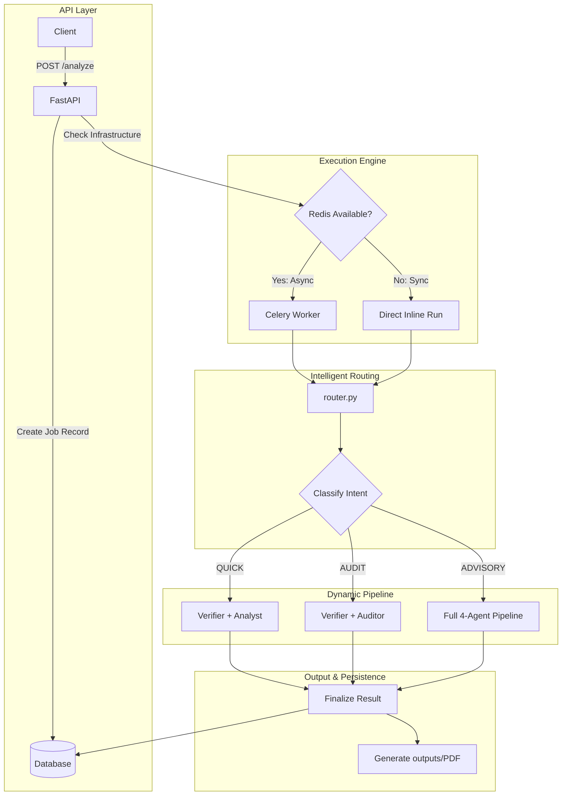

# Financial Document Analyzer — Production-Grade AI Pipeline

An intelligent, multi-agent financial analysis system built with **FastAPI**, **CrewAI**, and **Celery**. This platform transforms raw financial PDFs into professional investment reports through a specialized 4-stage agent pipeline.

---

## Key Features

*   **Intelligent Task Router**: Dynamically selects the most efficient agent path (QUICK, AUDIT, or ADVISORY) based on your query intent, saving API costs and reducing latency.
*   **Production-Grade Pipeline**: A sequential 4-agent crew (Verifier, Analyst, Auditor, Advisor) that shares context to deliver depth and accuracy.
*   **Hybrid Execution Engine**: Seamlessly switch between **Synchronous** (direct response) and **Asynchronous** (Redis/Celery queue) processing.
*   **Persistence & Persistence**: Full **SQLAlchemy** database integration to track job status and metadata.
*   **Professional PDF Export**: Automatically generates and stores formatted PDF reports for every analysis in the `outputs/` directory for historical tracking.
*   **Deterministic Tooling**: Custom regex-based metric extractors and risk inventory scanners supplement the agents' LLM reasoning.

---

## Tech Stack

*   **Framework**: FastAPI
*   **AI Orchestration**: CrewAI
*   **LLM Providers**: OpenAI (GPT-4o) or Google Gemini (2.5 Flash/Pro)
*   **Task Queue**: Celery + Redis
*   **Database**: SQLite (Default) or PostgreSQL (Production)
*   **PDF Logic**: PyPDF (Loading) & fpdf2 (Generation)

---

## Project Structure

```text
financial-analyzer-v3/
├── main.py              # FastAPI application & entry point
├── agents.py            # CrewAI agent personas (CFA/FRM certified)
├── task.py              # 4-stage pipeline task definitions
├── router.py            # Intelligent intent classifier & crew assembler
├── tools.py             # Deterministic metric & risk extractors
├── worker.py            # Celery worker configuration & task logic
├── database.py          # SQLAlchemy models (Jobs, Documents)
├── pdf_gen.py           # Analysis-to-PDF generation utility
├── outputs/             # (Auto-generated) Persistent store for PDF analysis reports
├── data/                # Temporary store for uploaded documents
├── Report.md            # Detailed debug/audit report of the refactor
├── DEEP_DIVE.md         # Line-by-line technical code explainer
├── requirements.txt     # Production-vetted dependency list
└── .env.example         # Template for environment configuration
```

---

## Setup & Installation

### 1. Environment Setup
```bash
# Clone the repository
cd financial-analyzer-v3

# Create and activate a virtual environment
python -m venv venv
source venv/bin/activate  # Windows: venv\Scripts\activate

# Install dependencies
pip install -r requirements.txt
```

### 2. Configuration
Copy `.env.example` to `.env` and add your API keys:
*   `OPENAI_API_KEY` (Required for GPT models)
*   `GOOGLE_API_KEY` (Required for Gemini fallback)
*   `SERPER_API_KEY` (Optional: Enables web search for the Analyst)
*   `REDIS_URL` (Optional: Enables asynchronous queue mode)

### 3. Running the Application

**Option A: Standard Mode (Synchronous)**
```bash
python main.py
```

**Option B: Scalable Mode (Queue)**
```bash
# Terminal 1: Start Redis (e.g., via Docker)
docker run -d -p 6379:6379 redis:alpine

# Terminal 2: Start Celery worker
celery -A worker worker --loglevel=info --concurrency=4

# Terminal 3: Start API
python main.py
```

---

## Usage Guide

### POST `/analyze`
Upload a PDF and ask a question.
```bash
curl -X POST http://localhost:8000/analyze \
  -F "file=@path/to/report.pdf" \
  -F "query=Is this company financially healthy and what are the top 3 risks?"
```

### GET `/jobs/{job_id}`
Poll the status of your analysis. Once `completed`, the full analysis is returned.

### GET `/jobs/{job_id}/results/pdf`
Download the professional PDF version of the final analysis.

---

## Architecture & Workflow

The system utilizes a dynamic, intent-based routing architecture that optimizes for LLM efficiency and cost.



### Fiduciary Governance Chain
1.  **Verification**: Confirm documents are legitimate and readable.
2.  **Analysis**: Extract metrics and identify YoY/QoQ trends.
3.  **Risk Audit**: Categorise and quantify risks (Market, Credit, Liquidity, Op).
4.  **Advisory**: Synthesise results into profile-specific investment guidance.

---

## Legal Disclaimer
This software is provided for educational and analytical purposes only. It does not constitute financial advice. Always verify AI-generated figures against official company filings.
